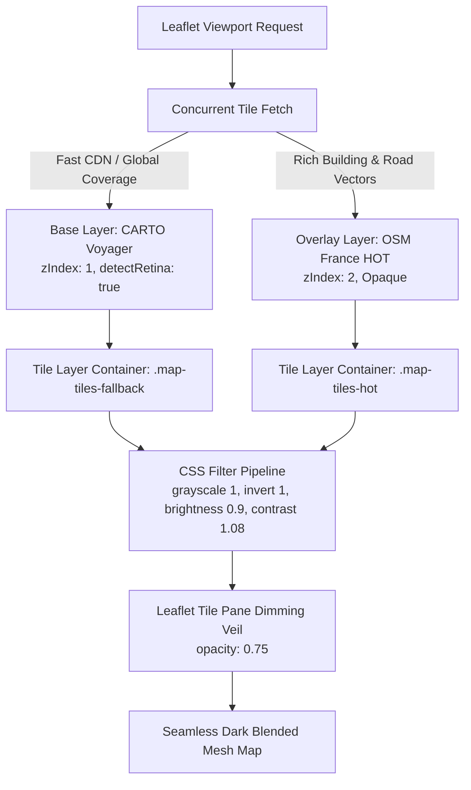

# Architectural Review: PotatoMesh Stacked Blended Map Tile Engine

## Executive Summary

The **PotatoMesh Blended Map Tile Engine** (`C:\AI_WEB_LAB\potato-mesh`) replaces traditional single-provider raster basemaps with a **resilient, keyless, stacked dual-provider architecture** paired with a unified CSS hardware-composited dark filter pipeline. 

By stacking a fast, reliable base layer (**CARTO Voyager**) underneath a detailed humanitarian overlay layer (**OpenStreetMap France HOT**) and filtering both layers identically, the engine eliminates map tile pop-in, avoids light/dark checkerboarding during asynchronous tile loading, and operates with zero proprietary API keys or rate limits.

---

## 1. Core Architecture: Stacked Dual-Layer Engine



### Layer Specifications

| Parameter | Base Layer (CARTO Voyager) | Overlay Layer (OSM France HOT) |
| :--- | :--- | :--- |
| **Provider** | CARTO CDN (`cartocdn.com`) | OpenStreetMap France / Humanitarian OSM Team |
| **Tile Endpoint** | `https://{s}.basemaps.cartocdn.com/rastertiles/voyager/{z}/{x}/{y}{r}.png` | `https://{s}.tile.openstreetmap.fr/hot/{z}/{x}/{y}.png` |
| **Subdomains** | `a`, `b`, `c`, `d` | `a`, `b`, `c` |
| **Stacking zIndex** | `1` (Renders underneath) | `2` (Renders on top) |
| **Retina / HiDPI** | Native `@2x` (`detectRetina: true`) | Standard `256x256` |
| **CORS Mode** | `anonymous` (Allows untainted Canvas exports) | `anonymous` |
| **Max Zoom** | 19 | 19 |
| **CSS Class** | `map-tiles-fallback` | `map-tiles-hot` |

---

## 2. Visual & Filter Pipeline

### Why Color-Sourced Basemaps?
Traditional dark basemaps (e.g. *CartoDB Dark Matter*) are pre-rendered into dark monochromatic tiles. When combined with other providers (like OSM or OpenTopoMap), mixing tiles creates a jarring checkerboard effect because arrived tiles are dark while pending/fallback tiles are bright.

PotatoMesh solves this by choosing **two natively colorful, high-contrast light raster styles** (CARTO Voyager and OSM HOT) and applying **identical CSS post-processing**:

```css
/* Single dimming veil on the Leaflet tile pane */
#map .leaflet-tile-pane {
    opacity: 0.75;
}

/* Identical static dark filter applied to both layer containers */
#map .leaflet-layer.map-tiles-hot,
#map .leaflet-layer.map-tiles-fallback {
    filter: grayscale(1) invert(1) brightness(0.9) contrast(1.08);
    -webkit-filter: grayscale(1) invert(1) brightness(0.9) contrast(1.08);
}
```

### How the Visual Handover Works
1. **Initial Viewport Pan/Zoom**: Both CARTO Voyager (`zIndex: 1`) and OSM HOT (`zIndex: 2`) are requested simultaneously.
2. **Instant Base Fill**: CARTO Voyager tiles typically resolve in <50ms due to extensive Cloudflare edge caching, immediately painting a crisp, dark road and landmass foundation.
3. **Smooth Dissolve Handover**: As the heavier OSM HOT tiles arrive, Leaflet's built-in 200ms opacity transition fades the HOT tile in over the CARTO tile.
4. **Coherent Tone**: Because both underlying tiles were processed through the exact same mathematical matrix (`grayscale` → `invert` → `brightness` → `contrast`), the visual transition reads as a subtle resolution increase rather than a lighting or stylistic shift.

---

## 3. Resilience & Failure Analysis

| Scenario | Legacy Single-Provider (Carto Dark) | PotatoMesh Blended Engine |
| :--- | :--- | :--- |
| **OSM HOT Tile Slow / Delayed** | N/A | CARTO Voyager tile displays instantly below; no grey grid or blank cells. |
| **OSM HOT CDN Outage** | N/A | Base layer continues serving 100% of global viewport without interruption. |
| **CARTO CDN Throttle / Rate Limit** | Map fails completely with grey tiles | OSM HOT overlay covers viewport; mesh topology remains fully operable. |
| **Offline / PWA Mode** | Tiles fail unless pre-cached | Service Worker (`vite-plugin-pwa`) caches both CDNs (`CacheFirst` policy up to 4,000 tiles). |
| **API Key Deprecation / Watermark** | "API KEY REQUIRED" watermarks appear (as seen on legacy CartoDB endpoints) | 100% keyless, public community endpoints with zero watermarking. |

---

## 4. Performance & Resource Impact

- **Network Overhead**: Both tile sets download concurrently (~15–25 KB per tile). On modern mobile LTE/5G connections, the total bandwidth overhead is negligible (~80 KB per viewport).
- **GPU Compositing**: Filters are applied to the parent `.leaflet-layer` element container rather than individual `` tile nodes. This allows hardware-accelerated GPU layer compositing with zero CPU per-pixel recomputation during panning and zooming.
- **Preconnect Acceleration**: Added `<link rel="preconnect">` tags for both `a.basemaps.cartocdn.com` and `a.tile.openstreetmap.fr` to eliminate TCP/TLS handshake latency on page load.

---

## 5. Implementation in Meshlog

### Changes Applied
1. **Nuked Legacy CartoDB Endpoints**:
   - Removed obsolete `"Carto Dark"` and `"Carto Light"` layers from the map layer switcher.
2. **Engineered `Blended Dark` as Permanent Default**:
   - Instantiated `L.layerGroup([cartoVoyager, osmHot])` and registered as `"Dark (OSM Blend)"`.
   - Defaulted `localStorage.selectedMapLayer` to `"Dark (OSM Blend)"`.
3. **PWA & Offline Cache Updated**:
   - Updated `vite.config.js` Workbox cache regex to cache `*.tile.openstreetmap.fr` along with `*.basemaps.cartocdn.com`.
4. **CSS Hardware Filter Applied**:
   - Added `.map-tiles-hot` and `.map-tiles-fallback` rules to style.css.
