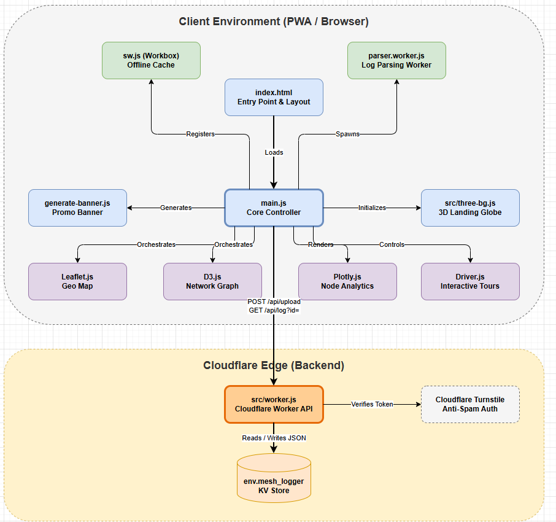

  
  <h1>Meshtastic Log Mapper (Meshlog)</h1>
  
<b>Advanced Topology & Network Graph Analyzer for Meshtastic Networks</b>

---

  

---

**Meshtastic Log Mapper** parses raw network log data to visualize node connectivity, signal strength, traffic volume, and device telemetry. Built with offline-first capabilities, it operates entirely as a Progressive Web App (PWA) even when you are off-grid.

##  Features

-  **Geographic Visualization**: Plots nodes with GPS coordinates on an interactive map.
-  **Logical Network Graph**: Renders a force-directed physics graph to visualize network topology, link quality, and Signal-to-Noise Ratio (SNR).
-  **Unmapped Node Tracking**: Identifies and tracks active nodes that lack GPS data but are participating in the mesh.
-  **Packet Inspection**: Includes a live terminal view for monitoring network traffic and inspecting raw packet payloads.
-  **Telemetry Analysis**: Displays hardware models, battery levels, and channel utilization metrics for individual nodes.
-  **Offline Functionality**: Installs locally as a PWA to function without an internet connection in the field.

##  Usage

1. **Access the application** at [https://meshlog.camal.eu](https://meshlog.camal.eu).
2. **Upload Logs**: Provide a valid network log file via the upload interface to begin parsing.
3. **Explore**: Navigate between the geographic map, the logical network graph, and the unmapped node list using the provided interface controls. 
4. **Monitor**: The built-in terminal allows for live monitoring of packet logs based on the uploaded data.

##  Licensing

This project is licensed under the **PolyForm Noncommercial License 1.0.0**. 

You are permitted to view, fork, and modify the software for personal, academic, or hobbyist purposes. **Commercial use** of this software, its derivatives, or its output is strictly prohibited. For complete legal terms, refer to the `LICENSE` file included in the repository.

## © Copyright

Copyright (c) 2026 CardoSystems. All rights reserved.
